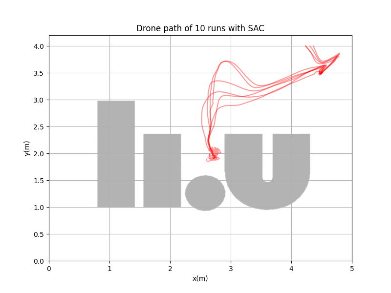

# Crazyflie RL navigation IN VISIONEN

This repository is build upon https://gitlab.liu.se/visionen/ros2/crazyswarm2

Please take a look at that repository for install instructions.

The added code can be found under cf_nodes/cf_nodes/crazyflie_RL

This code is to test trained models in the real world.

After following the install instructions and launching crazyflie the following scripts should be launched:

First "local_frame.py" should be launched: `ros2 run cf_nodes local_frame`

After this "command_RL.py" can be launched: `ros2 run cf_nodes command_RL`

This will start the command node and log the data.

To fly the drone "run_RL.py" is launched: `ros2 run cf_nodes run_RL`

The drone will take off and fly to the target.

After the drone reaches the goal or crashes it is recommended to restart all codes except "local_frame".

Starting the drone before the "launch" script is also advised.

